# 【微處理機】中興大學課程期末專題  
## 繳交資訊
- 電資學士班 侯竣奇 (4112064214)
- 所有程式專案可在 projects 資料夾中找到，附有 `.pcf` 檔
- 有疑問可來信 [houjunqimail@gmail.com](mailto:houjunqimail@gmail.com)

## 1. (15 pts) 下列請以 GPIOB 完成，七段顯示器型號為 DC56-11EWA：
### i. (5 pts) 將所有 pin 設定為 output mode，並使 pin 0~15 輸出為 0xAAAA。

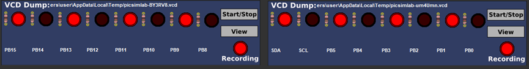

---

**Ans:**

程式碼 ([projects/1-i/Src/main.c](projects/1-i/Src/main.c))：

```c
#include "stm32f10x.h"

int main()
{
    RCC->APB2ENR |= 0xFC; // 啟用 GPIO 連接埠的 clock

    GPIOB->CRL = 0x33333333; // PB0 to PB7 outputs
    GPIOB->CRH = 0x33333333; // PB8 to PB15 outputs

    while (1) {
        GPIOB->ODR = 0xAAAA;
    }
}
```

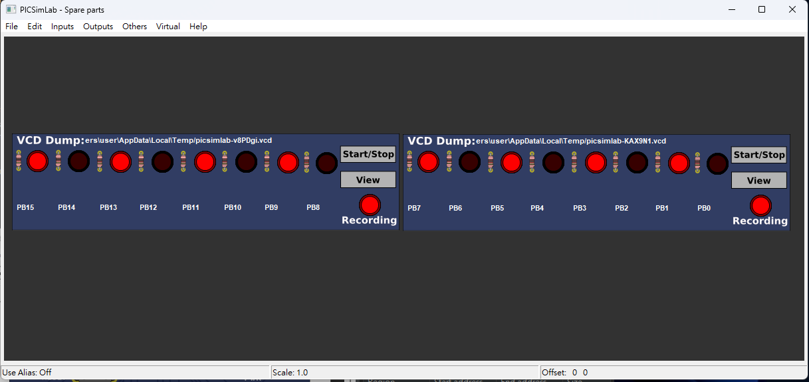

### ii. (5 pts) 根據圖一完成表一：(Low 為輸出低電壓 0，High 為輸出高電位 1)

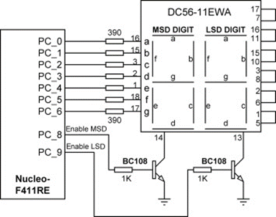

---

**Ans:**

|     |     |     |     |     |     |     |     |     |           |
| --- | --- | --- | --- | --- | --- | --- | --- | --- | --------- |
|     | x   | g   | f   | e   | d   | c   | b   | a   | PORTB_ODR |
| 0   | L   | L   | H   | H   | H   | H   | H   | H   | 0x3F      |
| 1   | L   | L   | L   | L   | L   | H   | H   | L   | 0x6       |
| 2   | L   | H   | L   | H   | H   | L   | H   | H   | 0x5B      |
| 3   | L   | H   | L   | L   | H   | H   | H   | H   | 0x4F      |
| 4   | L   | H   | H   | L   | L   | H   | H   | L   | 0x66      |
| 5   | L   | H   | H   | L   | H   | H   | L   | H   | 0x6D      |
| 6   | L   | H   | H   | H   | H   | H   | L   | H   | 0x7D      |
| 7   | L   | L   | H   | L   | L   | H   | H   | H   | 0x27      |
| 8   | L   | H   | H   | H   | H   | H   | H   | H   | 0x7F      |
| 9   | L   | H   | H   | L   | H   | H   | H   | H   | 0x6F      |

### iii. (5 pts) 編寫程式使七段顯示器顯示 20。

**Ans:**

程式碼 ([projects/1-iii/Src/main.c](projects/1-iii/Src/main.c))：

```c
#include "stm32f10x.h"

int main()
{
    RCC->APB2ENR |= 0xFC; // 啟用 GPIO 連接埠的 clock

    GPIOB->CRL = 0x33333333; // PB0 to PB7 outputs
    GPIOB->CRH = 0x33333333; // PB8 to PB15 outputs

    while (1) {
        GPIOB->ODR = 0x3F5B;
    }
}
```

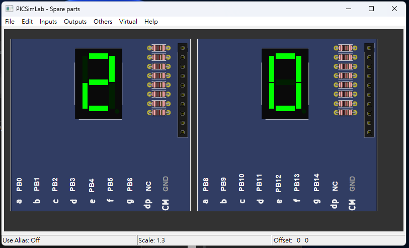

## 2. (10 pts) 下列請以 GPIOA 完成，超音波模組型號為 HC-SR04：
### i. (5 pts) Generate a pulse with a duration of 10us via PA0 using a _for_ loop.

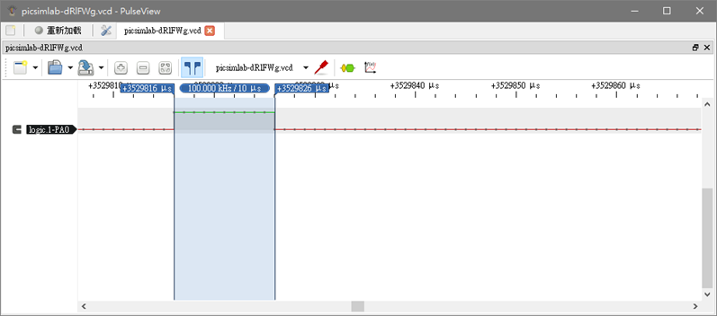

---

**Ans:**

- **必須把 Qemu CPU MIPS 設成 `62.5`。**

程式碼 ([projects/2-i/Src/main.c](projects/2-i/Src/main.c))：

```c
#include "stm32f10x.h"

void delay_us(uint16_t t);
void delay_ms(uint16_t t);

int main()
{
    RCC->APB2ENR |= 0xFC; // 啟用 GPIO 連接埠的 clock

    GPIOA->CRL = 0x33333333; // PA0 to PA7 outputs
    GPIOA->CRH = 0x33333333; // PA8 to PA15 outputs

    delay_ms(100); // 緩衝 100ms

    GPIOA->ODR = 1 << 0; // PA0 on
    delay_us(10);
    GPIOA->ODR = 0 << 0; // PA0 off
}

void delay_us(uint16_t t)
{
    volatile unsigned long l = 0;

    for (uint16_t i = 0; i < t; i++)
        for (l = 0; l < 7; l++)
            ;
}
void delay_ms(uint16_t t)
{
    volatile unsigned long l = 0;

    for (uint16_t i = 0; i < t; i++)
        for (l = 0; l < 9000; l++)
            ;
}
```

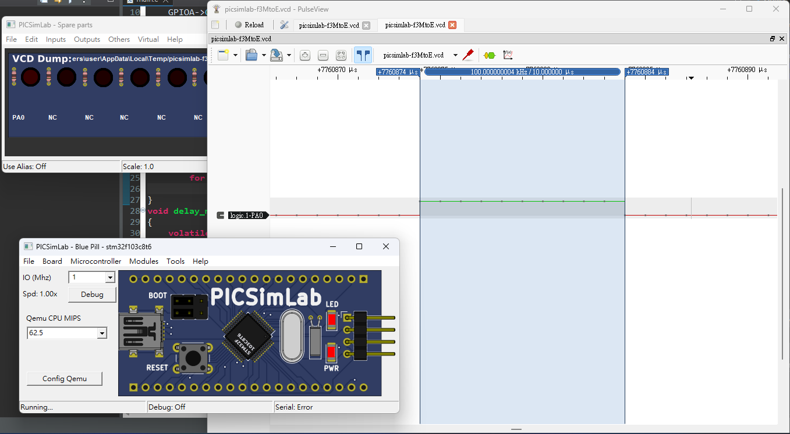

### ii. (5 pts) 編寫程式讀取超音波模組數據。

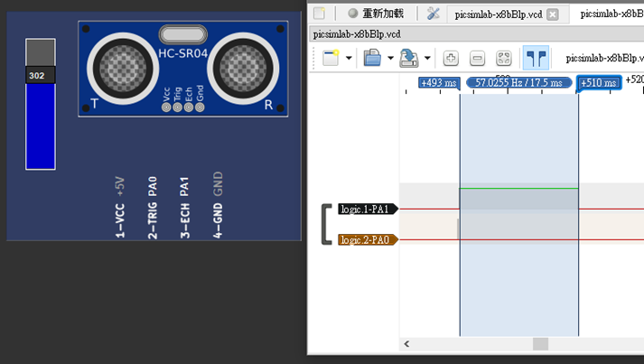

---

**Ans:**

程式碼 ([projects/2-ii/Src/main.c](projects/2-ii/Src/main.c))：

```c
#include "stm32f10x.h"
void delay_us(uint16_t t);
void delay_ms(uint16_t t);

int main()
{
    RCC->APB2ENR |= 0xFC; // 啟用 GPIO 連接埠的 clock

    GPIOA->CRL = 0x33333343; // PA0, PA2 ~ PA7 outputs, PA1 input
    GPIOA->CRH = 0x33333333; // PA8 to PA15 outputs

    delay_ms(100); // 緩衝100ms

    GPIOA->ODR = 1 << 0; // PA0 on
    delay_us(10);
    GPIOA->ODR = 0 << 0; // PA0 off
}

void delay_us(uint16_t t)
{
    volatile unsigned long l = 0;

    for (uint16_t i = 0; i < t; i++)
        for (l = 0; l < 7; l++)
            ;
}
void delay_ms(uint16_t t)
{
    volatile unsigned long l = 0;

    for (uint16_t i = 0; i < t; i++)
        for (l = 0; l < 9000; l++)
            ;
}
```

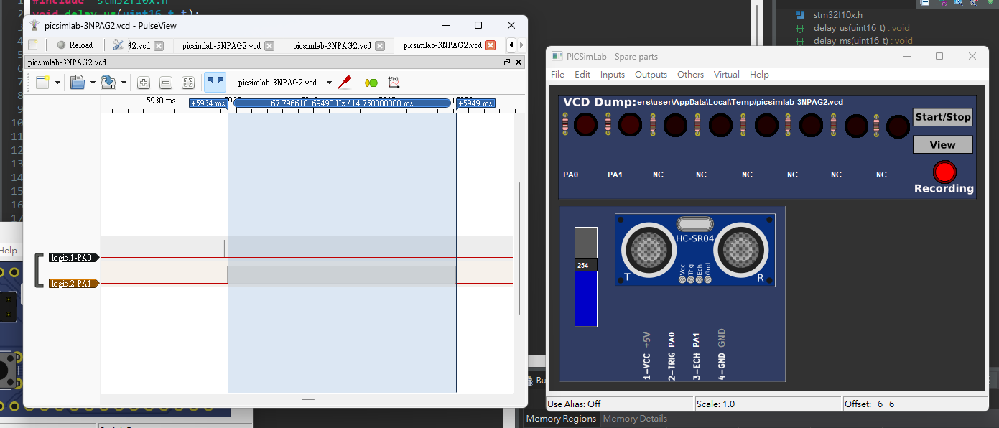

## 3. (10 pts) 下列請以 TIM2 (PWM) 完成，伺服馬達型號為 SG90：
### i. (5 pts) Generate a square wave with a period 20ms.

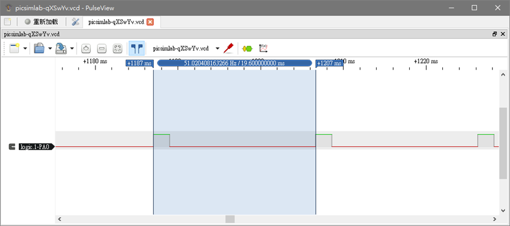

---

**Ans:**

程式碼 ([projects/3-i/Src/main.c](projects/3-i/Src/main.c))：

```c
#include "stm32f10x.h"

int main()
{
    RCC->APB2ENR |= 0xFC; // 啟用 GPIO 連接埠的 clock
    RCC->APB1ENR |= (1 << 0);
    GPIOA->CRL |= 0xB;
    TIM2->CCER = 0x1;
    TIM2->CCMR1 |= 0x60;
    TIM2->PSC = 72 - 1;
    TIM2->ARR = 20000 - 1;
    TIM2->CCR1 = 5000;
    TIM2->CR1 = 1;

    while (1) { }
}
```

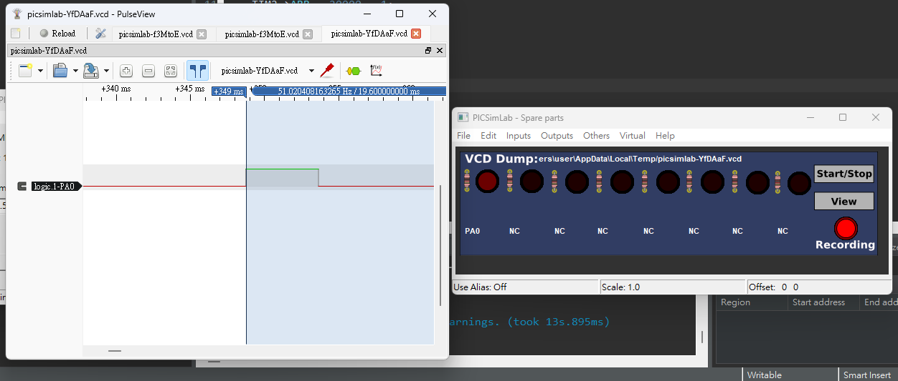

### ii. (5 pts) 編寫程式使伺服馬達順時針與逆時針旋轉。

**Ans:**

要讓伺服馬達（SG90）旋轉，需要控制給它的 PWM 波形的 duty cycle。SG90 的範圍如下：

- Period: 20ms
- Duty cycle:
  - 1ms: 0 degree
  - 1.5ms: 90 degree
  - 2ms: 180 degree

透過調整 PWM 的 CCR1，可以控制伺服馬達的旋轉角度。

程式碼 ([projects/3-ii/Src/main.c](projects/3-ii/Src/main.c))：

```c
#include "stm32f10x.h"

void delay_ms(uint16_t t);

int main()
{
    RCC->APB2ENR |= 0xFC; // 啟用 GPIO 連接埠的 clock
    RCC->APB1ENR |= (1 << 0);
    GPIOA->CRL |= 0xB;
    TIM2->CCER = 0x1;
    TIM2->CCMR1 |= 0x60;
    TIM2->PSC = 72 - 1;
    TIM2->ARR = 20000 - 1;
    TIM2->CCR1 = 1500; // 初始值設定為中間位置
    TIM2->CR1 = 1;

    while (1) {
        // 順時針轉至 180 度
        TIM2->CCR1 = 2000;
        delay_ms(10000);

        // 逆時針轉至 0 度
        TIM2->CCR1 = 1000;
        delay_ms(10000);

        //		// 返回中心位置
        //		TIM2->CCR1 = 1500;
        //		delay_ms(10000);
    }
}

void delay_ms(uint16_t t)
{
    volatile unsigned long l = 0;

    for (uint16_t i = 0; i < t; i++)
        for (l = 0; l < 9000; l++)
            ;
}
```

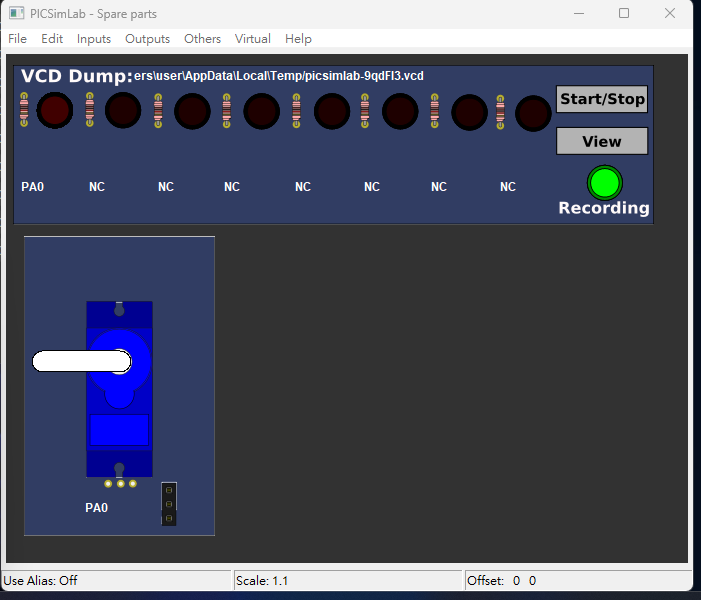

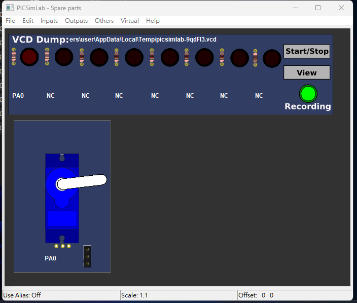

## 4. (10 pts) 下列請以 USART1 (baud rate 為 9600) 完成，藍芽模組型號為 HC-06：
### i. (5 pts) Send a character ('A') to the IO Virtual Term.

**Ans:**

程式碼 ([projects/4-i/Src/main.c](projects/4-i/Src/main.c))：

```c
#include "stm32f10x.h"

void delay_ms(uint16_t t);
void usart1_sendByte(unsigned char c);

int main()
{
    RCC->APB2ENR |= (1 << 14) | (1 << 2);
    GPIOA->CRH |= 0x000000B0;
    USART1->CR1 = 0x200C;
    USART1->BRR = 7500;

    usart1_sendByte('A');
}
void delay_ms(uint16_t t)
{
    volatile unsigned long l = 0;

    for (uint16_t i = 0; i < t; i++)
        for (l = 0; l < 9000; l++)
            ;
}

void usart1_sendByte(unsigned char c)
{
    USART1->DR = c;
    while ((USART1->SR & (1 << 6)) == 0)
        ;
}
```

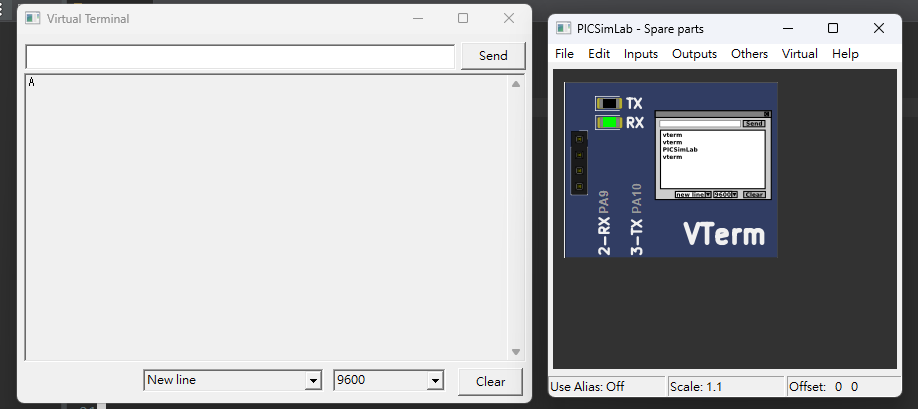