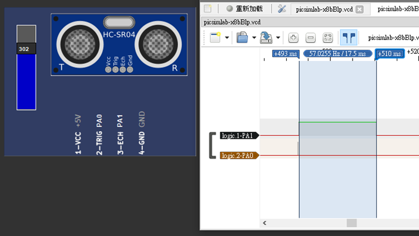

# 【微處理機】中興大學課程期末專題
## 繳交資訊
- 電資學士班 侯竣奇 (4112064214)
- 所有程式專案可在 projects 資料夾中找到，附有 `.pcf` 檔
- 有疑問可來信 [houjunqimail@gmail.com](mailto:houjunqimail@gmail.com)
- 本報告同步發佈於 Github ([coke5151/nchu-microprocessor-final](https://github.com/coke5151/nchu-microprocessor-final/))

## 1. (15 pts) 下列請以 GPIOB 完成，七段顯示器型號為 DC56-11EWA：
### i. (5 pts) 將所有 pin 設定為 output mode，並使 pin 0~15 輸出為 0xAAAA。


---

**Ans:**

程式碼 ([projects/1-i/Src/main.c](projects/1-i/Src/main.c))：

```c
#include "stm32f10x.h"

int main()
{
    RCC->APB2ENR |= 0xFC; // 啟用 GPIO 連接埠的 clock

    GPIOB->CRL = 0x33333333; // PB0 to PB7 outputs
    GPIOB->CRH = 0x33333333; // PB8 to PB15 outputs

    while (1) {
        GPIOB->ODR = 0xAAAA;
    }
}
```


### ii. (5 pts) 根據圖一完成表一：(Low 為輸出低電壓 0，High 為輸出高電位 1)


---

**Ans:**

|     |     |     |     |     |     |     |     |     |           |
| --- | --- | --- | --- | --- | --- | --- | --- | --- | --------- |
|     | x   | g   | f   | e   | d   | c   | b   | a   | PORTB_ODR |
| 0   | L   | L   | H   | H   | H   | H   | H   | H   | 0x3F      |
| 1   | L   | L   | L   | L   | L   | H   | H   | L   | 0x6       |
| 2   | L   | H   | L   | H   | H   | L   | H   | H   | 0x5B      |
| 3   | L   | H   | L   | L   | H   | H   | H   | H   | 0x4F      |
| 4   | L   | H   | H   | L   | L   | H   | H   | L   | 0x66      |
| 5   | L   | H   | H   | L   | H   | H   | L   | H   | 0x6D      |
| 6   | L   | H   | H   | H   | H   | H   | L   | H   | 0x7D      |
| 7   | L   | L   | H   | L   | L   | H   | H   | H   | 0x27      |
| 8   | L   | H   | H   | H   | H   | H   | H   | H   | 0x7F      |
| 9   | L   | H   | H   | L   | H   | H   | H   | H   | 0x6F      |

### iii. (5 pts) 編寫程式使七段顯示器顯示 20。

**Ans:**

程式碼 ([projects/1-iii/Src/main.c](projects/1-iii/Src/main.c))：

```c
#include "stm32f10x.h"

int main()
{
    RCC->APB2ENR |= 0xFC; // 啟用 GPIO 連接埠的 clock

    GPIOB->CRL = 0x33333333; // PB0 to PB7 outputs
    GPIOB->CRH = 0x33333333; // PB8 to PB15 outputs

    while (1) {
        GPIOB->ODR = 0x3F5B;
    }
}
```


## 2. (10 pts) 下列請以 GPIOA 完成，超音波模組型號為 HC-SR04：
### i. (5 pts) Generate a pulse with a duration of 10us via PA0 using a _for_ loop.


---

**Ans:**

- **必須把 Qemu CPU MIPS 設成 `62.5`。**

程式碼 ([projects/2-i/Src/main.c](projects/2-i/Src/main.c))：

```c
#include "stm32f10x.h"

void delay_us(uint16_t t);
void delay_ms(uint16_t t);

int main()
{
    RCC->APB2ENR |= 0xFC; // 啟用 GPIO 連接埠的 clock

    GPIOA->CRL = 0x33333333; // PA0 to PA7 outputs
    GPIOA->CRH = 0x33333333; // PA8 to PA15 outputs

    delay_ms(100); // 緩衝 100ms

    GPIOA->ODR = 1 << 0; // PA0 on
    delay_us(10);
    GPIOA->ODR = 0 << 0; // PA0 off
}

void delay_us(uint16_t t)
{
    volatile unsigned long l = 0;

    for (uint16_t i = 0; i < t; i++)
        for (l = 0; l < 7; l++)
            ;
}
void delay_ms(uint16_t t)
{
    volatile unsigned long l = 0;

    for (uint16_t i = 0; i < t; i++)
        for (l = 0; l < 9000; l++)
            ;
}
```


### ii. (5 pts) 編寫程式讀取超音波模組數據。



---

**Ans:**

程式碼 ([projects/2-ii/Src/main.c](projects/2-ii/Src/main.c))：

```c
#include "stm32f10x.h"
void delay_us(uint16_t t);
void delay_ms(uint16_t t);

int main()
{
    RCC->APB2ENR |= 0xFC; // 啟用 GPIO 連接埠的 clock

    GPIOA->CRL = 0x33333343; // PA0, PA2 ~ PA7 outputs, PA1 input
    GPIOA->CRH = 0x33333333; // PA8 to PA15 outputs

    delay_ms(100); // 緩衝100ms

    GPIOA->ODR = 1 << 0; // PA0 on
    delay_us(10);
    GPIOA->ODR = 0 << 0; // PA0 off
}

void delay_us(uint16_t t)
{
    volatile unsigned long l = 0;

    for (uint16_t i = 0; i < t; i++)
        for (l = 0; l < 7; l++)
            ;
}
void delay_ms(uint16_t t)
{
    volatile unsigned long l = 0;

    for (uint16_t i = 0; i < t; i++)
        for (l = 0; l < 9000; l++)
            ;
}
```


## 3. (10 pts) 下列請以 TIM2 (PWM) 完成，伺服馬達型號為 SG90：
### i. (5 pts) Generate a square wave with a period 20ms.


---

**Ans:**

程式碼 ([projects/3-i/Src/main.c](projects/3-i/Src/main.c))：

```c
#include "stm32f10x.h"

int main()
{
    RCC->APB2ENR |= 0xFC; // 啟用 GPIO 連接埠的 clock
    RCC->APB1ENR |= (1 << 0);
    GPIOA->CRL |= 0xB;
    TIM2->CCER = 0x1;
    TIM2->CCMR1 |= 0x60;
    TIM2->PSC = 72 - 1;
    TIM2->ARR = 20000 - 1;
    TIM2->CCR1 = 5000;
    TIM2->CR1 = 1;

    while (1) { }
}
```


### ii. (5 pts) 編寫程式使伺服馬達順時針與逆時針旋轉。

**Ans:**

要讓伺服馬達（SG90）旋轉，需要控制給它的 PWM 波形的 duty cycle。SG90 的範圍如下：

- Period: 20ms
- Duty cycle:
  - 1ms: 0 degree
  - 1.5ms: 90 degree
  - 2ms: 180 degree

透過調整 PWM 的 CCR1，可以控制伺服馬達的旋轉角度。

程式碼 ([projects/3-ii/Src/main.c](projects/3-ii/Src/main.c))：

```c
#include "stm32f10x.h"

void delay_ms(uint16_t t);

int main()
{
    RCC->APB2ENR |= 0xFC; // 啟用 GPIO 連接埠的 clock
    RCC->APB1ENR |= (1 << 0);
    GPIOA->CRL |= 0xB;
    TIM2->CCER = 0x1;
    TIM2->CCMR1 |= 0x60;
    TIM2->PSC = 72 - 1;
    TIM2->ARR = 20000 - 1;
    TIM2->CCR1 = 1500; // 初始值設定為中間位置
    TIM2->CR1 = 1;

    while (1) {
        // 順時針轉至 180 度
        TIM2->CCR1 = 2000;
        delay_ms(10000);

        // 逆時針轉至 0 度
        TIM2->CCR1 = 1000;
        delay_ms(10000);

        //		// 返回中心位置
        //		TIM2->CCR1 = 1500;
        //		delay_ms(10000);
    }
}

void delay_ms(uint16_t t)
{
    volatile unsigned long l = 0;

    for (uint16_t i = 0; i < t; i++)
        for (l = 0; l < 9000; l++)
            ;
}
```


## 4. (10 pts) 下列請以 USART1 (baud rate 為 9600) 完成，藍芽模組型號為 HC-06：
### i. (5 pts) Send a character ('A') to the IO Virtual Term.

**Ans:**

程式碼 ([projects/4-i/Src/main.c](projects/4-i/Src/main.c))：

```c
#include "stm32f10x.h"

void delay_ms(uint16_t t);
void usart1_sendByte(unsigned char c);

int main()
{
    RCC->APB2ENR |= (1 << 14) | (1 << 2);
    GPIOA->CRH |= 0x000000B0;
    USART1->CR1 = 0x200C;
    USART1->BRR = 7500;

    usart1_sendByte('A');
}
void delay_ms(uint16_t t)
{
    volatile unsigned long l = 0;

    for (uint16_t i = 0; i < t; i++)
        for (l = 0; l < 9000; l++)
            ;
}

void usart1_sendByte(unsigned char c)
{
    USART1->DR = c;
    while ((USART1->SR & (1 << 6)) == 0)
        ;
}
```


### ii. (5 pts) 編寫程式使藍芽 (USART1) 每秒發送一個數字給 IO Virtual Term，數字依序為 0 至 20。

**Ans:**

程式碼 ([projects/4-ii/Src/main.c](projects/4-ii/Src/main.c))：

```c
#include "stm32f10x.h"
#include <string.h>

void delay_ms(uint16_t t);
void usart1_sendByte(unsigned char c);
void usart1_sendStr(char* str); // 字串輸出

int main()
{
    RCC->APB2ENR |= (1 << 14) | (1 << 2);
    GPIOA->CRH |= 0x000000B0;
    USART1->CR1 = 0x200C;
    USART1->BRR = 7500;

    char tx_buffer[10]; // 緩衝區，用於存儲數字的字串表示

    for (int i = 0; i <= 20; i++) {
        // 將當前數字轉換為字串
        sprintf(tx_buffer, "%d\r\n", i);
        usart1_sendStr(tx_buffer);
        delay_ms(1000);
    }
}
void delay_ms(uint16_t t)
{
    volatile unsigned long l = 0;

    for (uint16_t i = 0; i < t; i++)
        for (l = 0; l < 9000; l++)
            ;
}

void usart1_sendByte(unsigned char c)
{
    USART1->DR = c;
    while ((USART1->SR & (1 << 6)) == 0)
        ;
}

void usart1_sendStr(char* str)
{
    int counter = 0;
    while (str[counter] != '\0') {
        usart1_sendByte(str[counter]);
        counter++;
    }
}
```


## 5. (55 pts) 下列請以 Interrupt 與 Timer 完成系統整合實現停車場系統（有關時間的都要用 Timer 或 SysTick 實現）：

> 第 5 題的專案程式碼在 [projects/5](projects/5) 資料夾中。

### i. 超音波感測（建議使用 Timer2）
#### A. (5 pts) 入口每 5 秒產生一個 trig 檢測是否有車子要進來。

---

**Ans:**


圖中的 PC13 即為入口的 Trig。

#### B. (5 pts) 出口先延遲 2.5 秒再每 5 秒產生一個 trig 是否有車子要出去。

每 5 秒產生一次 trig 的示意圖如下：


入口跟出口的 trig 時間相差 2.5 秒的示意圖如下：


---

**Ans:**

圖中的 PC14 即為出口的 Trig：


下圖為入口 PC13 與出口 PC14 的 Trig，相差 2.5 秒：


#### C. (15 pts) 使用中斷捕捉 Echo 上升時間和下降時間，然後透過下面公式轉換成公尺。（建議使用 SysTick 中斷，出來的結果與實際有誤差是正常現象）

$Echo\ signal\ duration * 343 / 2\ meters$


---

**Ans:**

下圖可以看到由 PA2（入口的 Echo）可以得到時間是 3.254 ms，經由公式可以得到距離 55.8 cm，與超音波感測器之設定值 56 相近：

$$
(3.254 * 10^{-3}) * 343 / 2 = 0.558\ m = 55.8 \ cm
$$


### ii. 伺服馬達閘門（建議使用 Timer1 和 Timer2）
#### A. (10 pts) 當出入口的 Echo 讀到的值小於 100 cm，相對應的閘門要打開讓車子進出，然後關閉閘門（伺服馬達打開和關閉閘門 90 度轉動）。

---

**Ans:**

（附上一張變化中的截圖，詳情請見錄影）


#### B. (10 pts) 車輛進入時剩餘車位減 1，車輛出去時剩餘車輛位加 1，並將剩餘車位數顯示於 2-digit 七位顯示器（車位數初始值 20）。

---

**Ans:**

閃爍中的示意截圖如下，詳情可見影片：


#### C. (5 pts) 當車位停滿時，七段顯示器顯示 00 並以一秒為週期進行閃爍（連續重複亮 0.5 sec 與暗 0.5 sec）。此時，閘門維持不動。

---

**Ans:**

我們用 VCD Dump 來觀察 PB0、PB1、PB8（由於是閃爍 00，所以 PB0 ~ PB6、PB8 ~ PB14 都會一起上下波動）：


由波形可以看到，7 段顯示器每次閃爍的週期是 1 秒，且亮 0.5 秒、暗 0.5 秒。

#### D. (5 pts) 透過藍芽 (USART1) 傳送目前車輛數目給 IO Virtual Term（轉成兩個數字的 ASCII Code 後傳送）。

---

**Ans:**

由下圖可以看到，持續印出 Current Cars 的同時，當車位剩 19 輛車時，也正確顯示目前車輛數是 01 輛：

